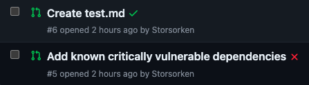
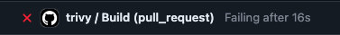

# Using Trivy with GitHub actions

Now that we know some about some of the things you can do with Trivy we might want to integrate it in our development pipelines. Whilst there are multiple different kinds of setups you could do we'll set up a simple integration. We'll use Trivy to scan PR for security issues.

## Setup

To create a GitHub action you need to define the desired actions in .yml files. This file then needs to be placed under `.github/workflows/`. Lets set that up.

This will create the directory structure. The -p flag will create parent directores if they don't exist.
```
mkdir -p .github/workflows
```{{exec}}

```
"name: trivy
on:
  push:
    branches:
    - main
  pull_request:
jobs:
  build:
    name: Build
    runs-on: ubuntu-20.04
    steps:
    - name: Checkout code
      uses: actions/checkout@v3

    - name: Run Trivy vulnerability scanner in fs mode
      uses: aquasecurity/trivy-action@master
      with:
        scan-type: 'fs'
        scan-ref: '.'
        exit-code: 1
        severity: 'CRITICAL,HIGH'
" > .github/workflows/trivy.yml
```{{exec}}

If you just do this to a repository on GitHub some basic workflow would now be set up. Since it's a bit sketchy to allow user of this tutorial push access to some repository on GitHub the setup is not testable in this tutorial but that would be all you need to do for a very basic setup.

The defined action will trigger either when you open a PR or push to main. It will run a job with two steps. The first just checks out the code so other steps can operate on the repo, the other runs Trivy vulnerability scanner on the repo. `scan-type: 'fs'` makes it scan the repo, as per default it will use a vulnerability and security scanner. `severity: 'CRITICAL,HIGH'` configures the scan so that only vulnerabilities with critical or high severity are reported. `exit-code: 1` defines that if any vulnerabilities are reported the check fails for the commit.

Results could look like this: 



The defined action is a slightly modified example of one of the provided example templates from Trivy. [Here you can look at many stock templates for different GitHub actions setups for Trivy](https://github.com/aquasecurity/trivy-action)
