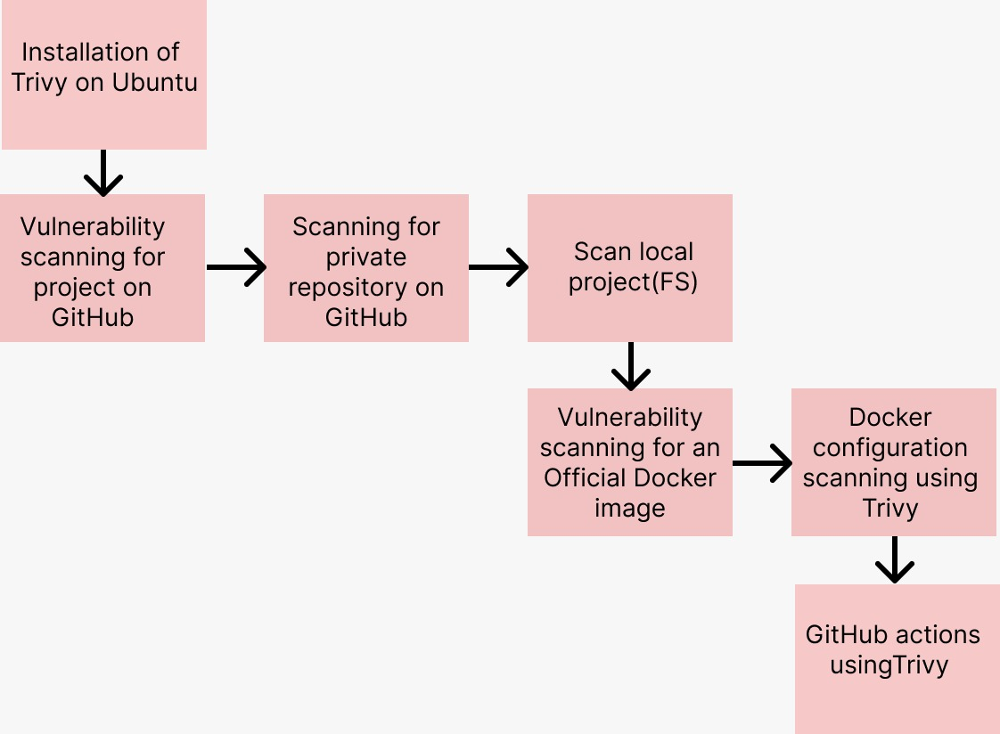

# Trivy tutorial

Welcome to this tutorial about the Trivy scanning tool! In this tutorial we will try out some of the things you can do with Trivy.

## Introduction

Trivy is an open source scanning tool that allows you to scan files you might work with as a software engineer. Security is important for DevOps/DevSecOps. Using Trivy you could reduce the risk of introducing vulnerabilities in your applications. Further, when you want to make use of some open source software you could use Trivy to check if it has some known vulnerabilities.

As of writing this tutorial there are four different kinds of scanners you can use:

1. vulnerability
2. secret
3. license
4. config

We'll encounter all of them during this tutorial.

The intended learning outcomes for this tutorial are:

1. basic understanding of what Trivy can do and how it can be used to scan for potential vulnerabilities
2. idea about how to setup Trivy in GitHub actions pipeline

The roadmap for the tutorial is as follows

